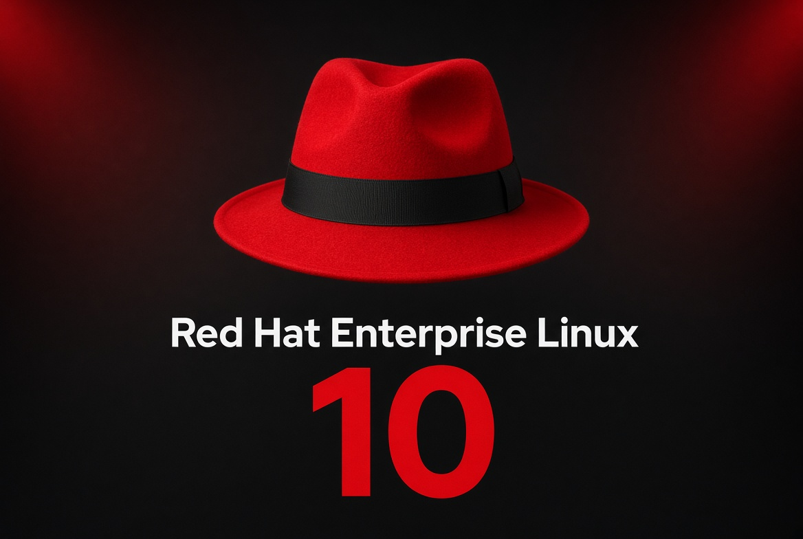

<div align="center">

# 🔴 Red Hat Enterprise Linux via WSL - Red Hat 10.2 

### Enterprise Linux on Windows — with MATE, GNOME and KDE Plasma 6**

[](https://www.redhat.com/en/technologies/linux-platforms/enterprise-linux)
[](https://learn.microsoft.com/windows/wsl/)
[](https://www.microsoft.com/windows/windows-11)
[](#-desktop-environments)

**A community project for running Red Hat Enterprise Linux under WSL2 and exploring full Linux desktop environments on Windows.**



</div>


---

Download REDHAT 10.2 for wsl HERE ✅

Download Red Hat Enterprise Linux 10.2 here: https://developers.redhat.com/products/rhel/download

Sign in to REDHAT PAGE and find: Red Hat Enterprise Linux 10.2 - Architecture: x86_64 - Image type: WSL2 image

You will see this and download - last in image is WSL REDHAT for Windows 11:

Look here: https://github.com/vinberg88/redhat/blob/main/redhat-wsl-image.png

Full install for REDHAT AS USER AND KDE 6: https://github.com/vinberg88/redhat/blob/main/Redhat-10.2-KDE6.txt ✅

---

# 🚀 START HERE — Install RHEL 10.2 on WSL2

The easiest way to start this project is to use the **official pre-built Red Hat Enterprise Linux 10.2 WSL2 image** from Red Hat.

Red Hat provides WSL images to RHEL subscribers, including the **no-cost Red Hat Developer Subscription**. You must sign in with a Red Hat account before downloading the image.

### 1. Create or sign in to your Red Hat account

Open the official RHEL download page:

🔗 [Download Red Hat Enterprise Linux](https://developers.redhat.com/products/rhel/download)

Sign in, then find:

```text
Red Hat Enterprise Linux 10.2
Architecture: x86_64
Image type: WSL2 image
```

Download the WSL2 image to Windows.

> [!NOTE]
> The official RHEL WSL images are intended for development and are documented by Red Hat as self-supported.

### 2. Install the downloaded RHEL 10.2 WSL image

If the download is a `.wsl` file, the simplest method is to **double-click the file in Windows**.

You can also install it from PowerShell:

```powershell
wsl --install --from-file "C:\\Users\\YOURNAME\\Downloads\\YOUR-RHEL-10.2-FILE.wsl"
```

Then check the installed distribution:

```powershell
wsl -l -v
```

Make sure RHEL is running as **WSL version 2**.

### 3. Change the default `cloud-user` account

The RHEL 10.2 WSL image tested for this project initially uses:

```text
cloud-user
```

This project changes that account to a personal username while keeping the existing UID and account configuration.

First start RHEL as root from PowerShell. Replace the distribution name with the name shown by `wsl -l -v`:

```powershell
wsl -d RedHatEnterpriseLinux-10.2 -u root
```

Example below changes `cloud-user` to `adolf`. **Use your own username instead.**

```bash
usermod -l adolf cloud-user
groupmod -n adolf cloud-user
usermod -d /home/adolf -m adolf
usermod -aG wheel adolf
```

Set passwords:

```bash
passwd adolf
passwd root
```

### 4. Register RHEL with Red Hat

Use the same Red Hat account that you used on the Red Hat website:

```bash
subscription-manager register
subscription-manager status
```

### 5. Install the basic tools

```bash
dnf install -y dnf-plugins-core sudo wget nano
```

### 6. Set your own user as the default WSL user

Edit:

```bash
nano /etc/wsl.conf
```

Add:

```ini
[user]
default=adolf
```

Change `adolf` to your own username.

If `/etc/wsl.conf` already contains other settings, keep them and only add the `[user]` section.

### 7. Check sudo access

The renamed user should remain a member of the `wheel` group. Verify it:

```bash
id adolf
```

RHEL normally grants sudo access through:

```text
%wheel ALL=(ALL) ALL
```

If you want to inspect or edit the sudo configuration, always use `visudo`:

```bash
EDITOR=nano visudo
```

### 8. Restart WSL

Exit RHEL:

```bash
exit
```

Then from PowerShell:

```powershell
wsl --shutdown
```

Start RHEL again and verify:

```bash
whoami
id
echo $HOME
sudo -v
```

A successful result should show your own username, UID 1000 and your new home directory.

Example from the tested setup:

```text
adolf
uid=1000(adolf) gid=1000(adolf) groups=1000(adolf),4(adm),10(wheel),190(systemd-journal)
/home/adolf
```

✅ **RHEL 10.2 is now ready for the desktop guides in this repository.**

> [!TIP]
> Want a customized RHEL WSL image instead of the official pre-built image? See the **Advanced Image Builder option** further down this page.

---

## 📖 About this project

Red Hat Enterprise Linux and Windows Subsystem for Linux make a powerful development combination.

You can keep **Windows 11** as your main desktop while using a real RHEL userspace for Linux development, shell tools, containers, automation and testing — without maintaining a traditional virtual machine.

This repository focuses on taking that setup one step further by experimenting with complete Linux desktop environments on RHEL under WSL2:

- 🟢 **MATE Desktop**
- 🔵 **GNOME**
- 🟣 **KDE Plasma 6**

The goal is to document clean, repeatable setups for **WSL2 + systemd + GUI + audio**, with **X410** used where a complete X11 desktop session is preferable and **WSLg** retained for native GUI integration and audio.

> [!IMPORTANT]
> Red Hat provides RHEL 8, RHEL 9 and RHEL 10 WSL images for development use. Red Hat documents these images as **self-supported**, and notes that graphical interfaces can behave differently under WSL. The desktop configurations in this repository are community experiments and are not official Red Hat desktop-on-WSL configurations.

---

## 🎨 Wallpapers

Community wallpapers for **RHEL 10** and the Red Hat fedora live in [`wallpapers/`](wallpapers/).

---

## ✨ Why RHEL on WSL?

### 🧱 Develop closer to production

Use the same RHEL family of tools, package management, libraries and system conventions that are common in enterprise Linux environments.

### 📦 Container development

RHEL provides first-class support for **Podman** and OCI containers. WSL makes it possible to build and test Linux workloads while remaining inside your Windows development environment.

### 💻 Windows + Linux workflow

Use Windows Terminal, Visual Studio Code, Git and other Windows tools alongside the RHEL command line and Linux filesystem.

### ⚙️ systemd support

Modern WSL2 can run **systemd**, which makes service management and complete desktop-session experiments considerably more practical.

### 🖥️ Linux GUI on Windows

Use **WSLg** for individual Linux GUI applications, or an external X server such as **X410** when experimenting with a complete X11 desktop session.

---

# 🖥️ Desktop Environments

This repository is designed around three desktop configurations.

| Desktop | Style | WSL display target | Project status |
|---|---|---|---|
| 🟢 **MATE** | Traditional, lightweight and fast | X410 / X11 | 🚧 Validation |
| 🔵 **GNOME** | Modern, integrated desktop | WSLg / X11 experiments | 🚧 Validation |
| 🟣 **KDE Plasma 6** | Feature-rich and highly customizable | X410 / X11 | 🚧 Validation |

The status will be updated as each configuration is installed, tested and documented.

---

## 🟢 MATE Desktop

MATE is an excellent candidate for WSL because it provides a complete traditional Linux desktop without requiring an especially heavy graphical stack.

### Planned MATE guide

- Package installation
- X410 configuration
- Correct `DISPLAY` handling
- D-Bus session startup
- systemd user session
- WSLg PulseAudio integration
- Clean start/stop launcher
- Diagnostic command
- Screenshot and tested version information

**Target launcher:**

```bash
mate-x410 start
mate-x410 doctor
mate-x410 stop
```

📸 **Screenshot:** will be added after the first validated RHEL + MATE session.

---

## 🔵 GNOME

GNOME is the desktop most closely associated with the standard RHEL graphical workstation experience.

Running a complete GNOME session inside WSL is more experimental than launching individual GNOME applications through WSLg, because modern GNOME relies heavily on Mutter, D-Bus, systemd user services and modern display-stack behavior.

### Planned GNOME guide

- GNOME package installation
- systemd and D-Bus preparation
- WSLg compatibility
- X11 / X410 testing where applicable
- Mutter session diagnostics
- WSLg audio
- Environment cleanup to prevent mixed WSLg/X410 windows
- Start/stop/doctor tooling

**Target launcher:**

```bash
gnome-wsl start
gnome-wsl doctor
gnome-wsl stop
```

📸 **Screenshot:** will be added after the first validated RHEL + GNOME session.

---

## 🟣 KDE Plasma 6

KDE Plasma 6 is the most configurable desktop in this project and is a particularly interesting target for a full X410 session.

A major objective is to keep the entire Plasma desktop on the same display server instead of allowing some applications to open through WSLg and others through X410.

### Planned KDE Plasma 6 guide

- Plasma 6 package installation
- X11 session verification
- X410 display detection
- KWin X11 startup
- plasmashell startup
- D-Bus and systemd user session
- WSLg PulseAudio integration
- Mixed-display protection
- Start/stop/doctor tooling

**Target launcher:**

```bash
kde6-x410 start
kde6-x410 doctor
kde6-x410 stop
```

📸 **Screenshot:** will be added after the first validated RHEL + KDE Plasma 6 session.

---

# 🧩 How the setup fits together

```text
┌────────────────────────────────────────────────────────┐
│                      Windows 11                          │
│                                                          │
│  ┌──────────────────────┐   ┌──────────────────────┐   │
│  │        WSLg          │   │         X410           │   │
│  │ GUI apps + audio     │   │ Full X11 desktop      │   │
│  └──────────┬───────────┘   └──────────┬───────────┘   │
│             │                            │               │
│  ┌──────────┴─────────────────────────┴────────────┐  │
│  │                     WSL2                          │  │
│  │                                                  │  │
│  │   Red Hat Enterprise Linux                      │  │
│  │   ├── systemd                                   │  │
│  │   ├── D-Bus                                     │  │
│  │   ├── MATE / GNOME / KDE Plasma 6               │  │
│  │   ├── Podman                                    │  │
│  │   └── Linux development tools                   │  │
│  └────────────────────────────────────────────────┘  │
└────────────────────────────────────────────────────────┘
```

---

# 🧪 Advanced option — Build your own RHEL WSL image

The official pre-built RHEL 10.2 WSL2 image above is the easiest option.

If you want a **custom RHEL image** with your own packages and image configuration, Red Hat Image Builder can generate a native WSL image.

🔗 [Red Hat Image Builder](https://console.redhat.com/insights/image-builder)

Official documentation:

🔗 [RHEL 10 — Generating a WSL2 image with Image Builder](https://docs.redhat.com/en/documentation/red_hat_enterprise_linux/10/html/composing_a_customized_rhel_system_image/generating-wsl2-image-with-rhel-image-builder)

A local Image Builder workflow can also build the WSL image with:

```bash
image-builder build wsl --blueprint <blueprint-name>
```

The generated `.wsl` image can then be installed on Windows.

---

# ✅ Windows prerequisites

This project targets **WSL2**.

From PowerShell:

```powershell
wsl --version
wsl --status
wsl --update
```

List installed distributions:

```powershell
wsl --list --verbose
```

The RHEL distribution should be running as **Version 2**.

---

# ⚙️ Enable systemd

Check the current init process inside RHEL:

```bash
ps -p 1 -o pid,comm,args
```

Expected result:

```text
PID COMMAND
  1 systemd
```

If systemd is not enabled, create or edit:

```bash
sudo nano /etc/wsl.conf
```

Use:

```ini
[boot]
systemd=true
```

Then restart WSL from Windows:

```powershell
wsl --shutdown
```

Start RHEL again and verify:

```bash
systemctl is-system-running
systemctl --failed --no-pager
```

---

# 🚪 WSLg vs X410

WSLg and X410 solve different problems.

| Feature | WSLg | X410 |
|---|---|---|
| Individual Linux GUI apps | ✅ Excellent | ✅ |
| Windows Start menu integration | ✅ | ❌ |
| Wayland applications | ✅ | Limited / depends on setup |
| X11 applications | ✅ | ✅ |
| Complete X11 desktop session | ⚠️ Not the primary WSLg use case | ✅ Preferred in this project |
| WSL audio integration | ✅ | ✅ Can reuse WSLg PulseAudio |
| Desktop isolation | Windows-integrated windows | Single desktop window / X server |

> [!NOTE]
> Microsoft explicitly describes WSLg as support for Linux GUI **applications**, not as a complete Linux desktop replacement. This project therefore uses X410 for full desktop experiments where appropriate.

---

# 🔊 Audio

When WSLg is installed, Linux applications can use the WSLg PulseAudio server.

Typical socket:

```text
/mnt/wslg/PulseServer
```

Useful check:

```bash
test -S /mnt/wslg/PulseServer && echo "WSLg audio socket: OK"
```

The desktop launchers in this repository will aim to reuse WSLg audio rather than starting a second competing audio server.

---

# 🔍 Basic RHEL WSL diagnostics

These commands are useful before installing a desktop:

```bash
echo "=== OS ==="
cat /etc/redhat-release
cat /etc/os-release

echo
echo "=== Kernel ==="
uname -a

echo
echo "=== systemd ==="
ps -p 1 -o pid,comm,args
systemctl is-system-running
systemctl --failed --no-pager

echo
echo "=== WSL ==="
grep -i microsoft /proc/version

echo
echo "=== GUI ==="
printf 'DISPLAY=%s\n' "$DISPLAY"
printf 'WAYLAND_DISPLAY=%s\n' "$WAYLAND_DISPLAY"

echo
echo "=== Audio ==="
test -S /mnt/wslg/PulseServer && echo "WSLg PulseAudio: OK" || echo "WSLg PulseAudio: not found"
```

---

# 📦 Podman

RHEL is an excellent environment for Podman-based development.

Install Podman:

```bash
sudo dnf install -y podman
podman --version
```

> [!NOTE]
> RHEL WSL releases may have WSL-specific Podman networking requirements. Check the current Red Hat documentation for your exact RHEL release before treating a WSL container setup as equivalent to a normal RHEL host.

---

# 🧪 Validation checklist

Each desktop guide will only be marked **READY** after the important WSL components have been tested.

```text
[ ] RHEL starts normally under WSL2
[ ] systemd is PID 1
[ ] systemd reports running/degraded state understood
[ ] User systemd session works
[ ] D-Bus session works
[ ] Windows interoperability works
[ ] DNS/networking works
[ ] X410 connection works
[ ] Desktop shell starts
[ ] Desktop stays on the intended display server
[ ] WSLg audio works
[ ] Desktop can be stopped cleanly
[ ] Re-launch works without rebooting Windows
```

---

# 🗂️ Planned repository layout

```text
redhat/
├── README.md
├── wallpapers/
│   ├── README.md
│   └── *.jpg
├── mate/
│   ├── README.md
│   └── scripts/
├── gnome/
│   ├── README.md
│   └── scripts/
├── kde6/
│   ├── README.md
│   └── scripts/
└── screenshots/
```

This keeps the main page clean while allowing each desktop environment to have a complete installation and troubleshooting guide.

---

# 🛣️ Roadmap

- [ ] Validate the base RHEL WSL installation
- [ ] Build the RHEL WSL diagnostic tool
- [ ] Add MATE Desktop
- [ ] Add MATE X410 launcher
- [ ] Add GNOME
- [ ] Validate GNOME display/session behavior
- [ ] Add KDE Plasma 6
- [ ] Add KDE6 X410 launcher
- [ ] Validate WSLg audio on all desktops
- [x] Add community wallpapers
- [ ] Add desktop screenshots
- [ ] Add tested-version matrix
- [ ] Add troubleshooting documentation
- [ ] Add YouTube installation/demo links

---

# ⚠️ Important notes

- This repository is an **independent community project**.
- It is **not affiliated with, sponsored by or endorsed by Red Hat, Inc.**
- Red Hat, RHEL and Red Hat Enterprise Linux are trademarks or registered trademarks of Red Hat, Inc.
- The wallpapers in this repository are unofficial community artwork.
- Full desktop environments under WSL are experimental and may require workarounds that are unnecessary on a native RHEL installation.
- WSLg is optimized for individual GUI applications; a complete desktop session may require a different display-server strategy.
- Always check the current Red Hat documentation for support status and release-specific limitations.

---

<div align="center">

## ❤️ Red Hat + WSL + Linux Desktop

**Windows on the outside. Enterprise Linux on the inside.**

Built as a community WSL desktop project by [vinberg88](https://github.com/vinberg88).

</div>
