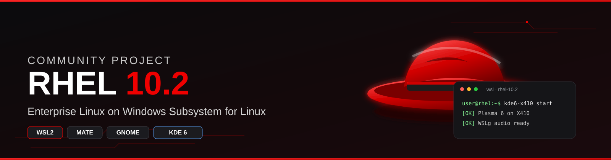
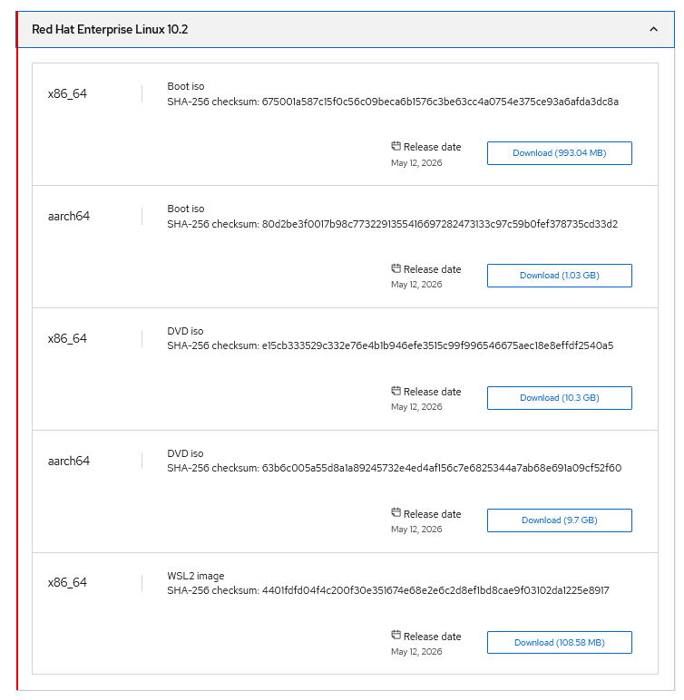

<div align="center">



# Red Hat Enterprise Linux on WSL - REDHAT 10

Sister WSL desktop projects for WSL

| Distro | Repo |
|---|---|
| AlmaLinux 10 | https://github.com/vinberg88/almalinux |
| openSUSE | https://github.com/vinberg88/opensuse |
| Ubuntu | https://github.com/vinberg88/ubuntu |
| Debian | https://github.com/vinberg88/debian |
| openSUSE Leap / Tumbleweed notes | https://github.com/vinberg88/suse |
| Manjaro | https://github.com/vinberg88/manjaro |
| Pop!_OS | https://github.com/vinberg88/pop-os-wsl |
| Overview site | https://github.com/vinberg88/vinberg88.github.io |


### RHEL 10.2 · Windows 11 · MATE · GNOME · KDE Plasma 6

[](https://www.redhat.com/en/technologies/linux-platforms/enterprise-linux)
[](https://github.com/vinberg88)
[](https://www.microsoft.com/windows/windows-11)
[](#-kde-plasma-6)
[](#-important-notes)

**Windows on the outside. Enterprise Linux on the inside.**

A community project for running a real Red Hat Enterprise Linux userspace under WSL2 — and then taking the extra step: full Linux desktops on Windows.

[Quick start](#-start-here--install-rhel-102-on-wsl2) ·
[Why RHEL + WSL](#-why-rhel-on-wsl) ·
[Desktops](#-desktop-environments) ·
[KDE launcher](#-launch-plasma-on-x410) ·
[Wallpapers](wallpapers/)

</div>

---

## At a glance

| You keep | You get |
|---|---|
| Windows 11 as the host desktop | A real **RHEL 10.2** userspace, not a lookalike |
| Windows Terminal, VS Code, Git, browsers | `dnf`, systemd, Podman, enterprise libraries |
| One machine, no extra VM window tax | Full desktop experiments: **MATE**, **GNOME**, **KDE Plasma 6** |
| WSLg for single Linux GUI apps | **X410** when you want a complete X11 session |

> [!IMPORTANT]
> This is an independent community project. It is **not affiliated with, sponsored by or endorsed by Red Hat, Inc.** Red Hat publishes official RHEL WSL images for development and documents them as **self-supported**. Graphical desktops under WSL are community experiments.

---

## Table of contents

- [Start here — install RHEL 10.2](#-start-here--install-rhel-102-on-wsl2)
- [About this project](#-about-this-project)
- [Why RHEL on WSL](#-why-rhel-on-wsl)
- [Desktop environments](#-desktop-environments)
- [How the stack fits together](#-how-the-setup-fits-together)
- [Advanced Image Builder option](#-advanced-option--build-your-own-rhel-wsl-image)
- [Windows prerequisites](#-windows-prerequisites)
- [Enable systemd](#-enable-systemd)
- [WSLg vs X410](#-wslg-vs-x410)
- [Audio](#-audio)
- [Diagnostics](#-basic-rhel-wsl-diagnostics)
- [Podman](#-podman)
- [Validation checklist](#-validation-checklist)
- [Roadmap](#-roadmap)
- [Notes](#-important-notes)

---

# 🚀 START HERE — Install RHEL 10.2 on WSL2

The fastest path is the **official pre-built Red Hat Enterprise Linux 10.2 WSL2 image**.

Red Hat provides WSL images to RHEL subscribers, including the **no-cost Red Hat Developer Subscription**. Sign in with a Red Hat account before downloading.

### 1. Create or sign in to your Red Hat account

Open the official download page:

🔗 [Download Red Hat Enterprise Linux](https://developers.redhat.com/products/rhel/download)

Sign in, then find:

```text
Red Hat Enterprise Linux 10.2
Architecture: x86_64
Image type: WSL2 image
```

Download the WSL2 image to Windows.

Look for the WSL2 row in the download list:

<p align="center">
  
</p>

> [!NOTE]
> Official RHEL WSL images are intended for development and are documented by Red Hat as self-supported.

### 2. Install the downloaded RHEL 10.2 WSL image

If the download is a `.wsl` file, the simplest method is to **double-click it in Windows**.

Or install from PowerShell:

```powershell
wsl --install --from-file "C:\\Users\\YOURNAME\\Downloads\\YOUR-RHEL-10.2-FILE.wsl"
```

Then check the installed distribution:

```powershell
wsl -l -v
```

RHEL must be running as **WSL version 2**.

### 3. Change the default `cloud-user` account

The tested RHEL 10.2 WSL image starts with:

```text
cloud-user
```

This project renames that account to a personal username while keeping the existing UID.

Start RHEL as root from PowerShell. Replace the distro name with whatever `wsl -l -v` shows:

```powershell
wsl -d RedHatEnterpriseLinux-10.2 -u root
```

Example below changes `cloud-user` to `adolf`. **Use your own username.**

```bash
usermod -l adolf cloud-user
groupmod -n adolf cloud-user
usermod -d /home/adolf -m adolf
usermod -aG wheel adolf
```

Set passwords:

```bash
passwd adolf
passwd root
```

### 4. Register RHEL with Red Hat

Use the same Red Hat account as on the website:

```bash
subscription-manager register
subscription-manager status
```

### 5. Install the basic tools

```bash
dnf install -y dnf-plugins-core sudo wget nano
```

### 6. Set your user as the default WSL user

Edit:

```bash
nano /etc/wsl.conf
```

Add:

```ini
[user]
default=adolf
```

Change `adolf` to your username. Keep any existing sections.

### 7. Check sudo access

The renamed user should stay in the `wheel` group:

```bash
id adolf
```

RHEL normally grants sudo through:

```text
%wheel ALL=(ALL) ALL
```

Inspect or edit sudo with `visudo` only:

```bash
EDITOR=nano visudo
```

### 8. Restart WSL

Exit RHEL:

```bash
exit
```

From PowerShell:

```powershell
wsl --shutdown
```

Start RHEL again and verify:

```bash
whoami
id
echo $HOME
sudo -v
```

A successful result shows your username, UID 1000 and the new home directory.

Example from the tested setup:

```text
adolf
uid=1000(adolf) gid=1000(adolf) groups=1000(adolf),4(adm),10(wheel),190(systemd-journal)
/home/adolf
```

✅ **RHEL 10.2 is now ready for the desktop guides in this repository.**

Full notes from the tested KDE 6 user setup: [`Redhat-10.2-KDE6.txt`](Redhat-10.2-KDE6.txt)

> [!TIP]
> Want a customized RHEL WSL image instead of the official pre-built one? See [Advanced Image Builder](#-advanced-option--build-your-own-rhel-wsl-image).

---

## 📖 About this project

Red Hat Enterprise Linux and Windows Subsystem for Linux are a strong development pair.

You can keep **Windows 11** as the main desktop and still use a real RHEL userspace for Linux development, shell tools, containers, automation and testing — without babysitting a classic virtual machine.

This repository pushes that setup one step further and documents complete Linux desktop environments on RHEL under WSL2:

- 🟢 **MATE Desktop** — light, traditional, a good first X410 target
- 🔵 **GNOME** — closest to a standard RHEL workstation feel
- 🟣 **KDE Plasma 6** — the most configurable full-session experiment, with a working launcher

The goal is a clean, repeatable path for **WSL2 + systemd + GUI + audio**. Use **X410** when you want a complete X11 desktop. Keep **WSLg** for native GUI apps and PulseAudio.

---

## 🎨 Wallpapers

Community wallpapers for **RHEL 10** and the Red Hat fedora live in [`wallpapers/`](wallpapers/).

Unofficial fan art — not official Red Hat brand assets.

---

## ✨ Why RHEL on WSL?

### 🧱 Develop closer to production

Same package manager, libraries, service model and conventions you meet on enterprise Linux.

### 📦 Container development

RHEL has first-class **Podman** and OCI support. WSL lets you build and test Linux workloads without leaving the Windows development machine.

### 💻 Windows + Linux workflow

Windows Terminal, Visual Studio Code, Git and browsers on one side. RHEL CLI, `/home` and Linux tooling on the other.

### ⚙️ systemd support

Modern WSL2 can run **systemd**, which is what makes services and full desktop-session experiments practical.

### 🖥️ Linux GUI on Windows

**WSLg** for individual apps. **X410** (or another X server) when you want a whole desktop inside one X11 session.

---

# 🖥️ Desktop Environments

| Desktop | Style | Display target | Status |
|---|---|---|---|
| 🟢 **MATE** | Traditional, lightweight | X410 / X11 | 🚧 Validation |
| 🔵 **GNOME** | Modern RHEL-style workstation | WSLg / X11 experiments | 🚧 Validation |
| 🟣 **KDE Plasma 6** | Feature-rich, highly customizable | X410 / X11 | 🧪 Launcher available |

---

## 🟢 MATE Desktop

MATE is a strong WSL candidate: a complete traditional desktop without an especially heavy graphics stack.

### Planned MATE guide

- Package installation
- X410 configuration and `DISPLAY` handling
- D-Bus session + systemd user session
- WSLg PulseAudio
- `start` / `stop` / `doctor` launcher
- Screenshot and tested versions

**Target launcher:**

```bash
mate-x410 start
mate-x410 doctor
mate-x410 stop
```

📸 Screenshot lands here after the first validated RHEL + MATE session.

---

## 🔵 GNOME

GNOME is the desktop most people associate with a RHEL graphical workstation.

A full GNOME session inside WSL is more experimental than launching individual GNOME apps through WSLg. Modern GNOME leans on Mutter, D-Bus, systemd user services and a modern display stack.

### Planned GNOME guide

- GNOME packages
- systemd and D-Bus preparation
- WSLg compatibility
- X11 / X410 tests where they still make sense
- Mutter session diagnostics
- Mixed WSLg/X410 window cleanup
- `start` / `stop` / `doctor` tooling

**Target launcher:**

```bash
gnome-wsl start
gnome-wsl doctor
gnome-wsl stop
```

📸 Screenshot lands here after the first validated RHEL + GNOME session.

---

## 🟣 KDE Plasma 6

KDE Plasma 6 is the most configurable desktop in the project and the first one with a dedicated X410 launcher.

The design goal is simple: keep the **entire** Plasma session on one display server. No Konsole on X410 and System Settings leaking out through WSLg.

### What you already have in this repo

| Piece | Where |
|---|---|
| Tested install notes | [`Redhat-10.2-KDE6.txt`](Redhat-10.2-KDE6.txt) |
| Launcher installer | [`scripts/install-kde6-x410-rhel10.sh`](scripts/install-kde6-x410-rhel10.sh) |
| Runtime command | `kde6-x410` → `/usr/local/bin/kde6-x410` |

### Planned KDE guide (still being written out as a full page)

- Plasma 6 package installation
- X11 session + X410 detection
- KWin X11 and plasmashell startup
- D-Bus and systemd user session
- WSLg PulseAudio reuse
- Mixed-display protection
- Start / stop / doctor tooling

### Launch Plasma on X410

Install the launcher as your normal WSL user — not as root:

```bash
chmod +x scripts/install-kde6-x410-rhel10.sh
./scripts/install-kde6-x410-rhel10.sh
```

Then:

```bash
kde6-x410 doctor
kde6-x410 start
kde6-x410 stop
kde6-x410 restart
kde6-x410 log
```

The launcher will:

1. Detect the Windows/X410 host address (override with `X410_HOST` if needed)
2. Force an X11 session (`DISPLAY=host:0.0`, Wayland unset, Qt/GDK on X11)
3. Reuse WSLg PulseAudio when `/mnt/wslg/PulseServer` exists
4. Import the environment into the user systemd/D-Bus session
5. Start `startplasma-x11` and keep a session log under `~/.local/state/kde6-x410/`

> [!NOTE]
> Start **X410 on Windows first** and allow WSL clients. If `kde6-x410 doctor` says X410 is not reachable, the desktop will not start.

---

# 🧩 How the setup fits together

```text
Windows 11
  WSLg (GUI apps + audio)     X410 (full X11 desktop)
                 \                 /
                  \               /
               WSL2 + RHEL 10.2
               systemd, D-Bus, MATE / GNOME / KDE Plasma 6, Podman
```

---

# 🧪 Advanced option — Build your own RHEL WSL image

The official pre-built RHEL 10.2 WSL2 image is the easy path.

If you want a **custom image** with your own packages, use Red Hat Image Builder.

🔗 [Red Hat Image Builder](https://console.redhat.com/insights/image-builder)

🔗 [RHEL 10 — Generating a WSL2 image with Image Builder](https://docs.redhat.com/en/documentation/red_hat_enterprise_linux/10/html/composing_a_customized_rhel_system_image/generating-wsl2-image-with-rhel-image-builder)

Local builder workflow:

```bash
image-builder build wsl --blueprint <blueprint-name>
```

Install the generated `.wsl` file on Windows the same way as the official image.

---

# ✅ Windows prerequisites

This project targets **WSL2**.

From PowerShell:

```powershell
wsl --version
wsl --status
wsl --update
wsl --list --verbose
```

The RHEL distribution must be **Version 2**.

---

# ⚙️ Enable systemd

Check PID 1 inside RHEL:

```bash
ps -p 1 -o pid,comm,args
```

Expected:

```text
PID COMMAND
  1 systemd
```

If systemd is not enabled, edit:

```bash
sudo nano /etc/wsl.conf
```

```ini
[boot]
systemd=true
```

Restart from Windows:

```powershell
wsl --shutdown
```

Then verify:

```bash
systemctl is-system-running
systemctl --failed --no-pager
```

---

# 🚪 WSLg vs X410

They solve different problems. This project uses both on purpose.

| Feature | WSLg | X410 |
|---|---|---|
| Individual Linux GUI apps | ✅ Excellent | ✅ |
| Windows Start menu integration | ✅ | ❌ |
| Wayland applications | ✅ | Limited / depends on setup |
| X11 applications | ✅ | ✅ |
| Complete X11 desktop session | ⚠️ Not the WSLg job | ✅ Preferred here |
| WSL audio | ✅ | ✅ Can reuse WSLg PulseAudio |
| Desktop isolation | Windows-integrated windows | One X server / one desktop |

> [!NOTE]
> Microsoft describes WSLg as support for Linux GUI **applications**, not as a full Linux desktop replacement. Full-session experiments in this repo therefore prefer X410.

---

# 🔊 Audio

With WSLg installed, Linux apps can talk to the WSLg PulseAudio server.

Typical socket:

```text
/mnt/wslg/PulseServer
```

Check:

```bash
test -S /mnt/wslg/PulseServer && echo "WSLg audio socket: OK"
```

Desktop launchers in this repository reuse WSLg audio instead of starting a second sound server.

---

# 🔍 Basic RHEL WSL diagnostics

Run this before you install a desktop:

```bash
echo "=== OS ==="
cat /etc/redhat-release
cat /etc/os-release

echo
echo "=== Kernel ==="
uname -a

echo
echo "=== systemd ==="
ps -p 1 -o pid,comm,args
systemctl is-system-running
systemctl --failed --no-pager

echo
echo "=== WSL ==="
grep -i microsoft /proc/version

echo
echo "=== GUI ==="
printf 'DISPLAY=%s\n' "$DISPLAY"
printf 'WAYLAND_DISPLAY=%s\n' "$WAYLAND_DISPLAY"

echo
echo "=== Audio ==="
test -S /mnt/wslg/PulseServer && echo "WSLg PulseAudio: OK" || echo "WSLg PulseAudio: not found"
```

Or, after the KDE launcher is installed:

```bash
kde6-x410 doctor
kde6-x410 doctor --verbose
```

---

# 📦 Podman

RHEL is a strong Podman development environment.

```bash
sudo dnf install -y podman
podman --version
```

> [!NOTE]
> RHEL WSL releases can have WSL-specific Podman networking requirements. Read the current Red Hat docs for your exact release before treating WSL containers as identical to a bare-metal RHEL host.

---

# 🧪 Validation checklist

A desktop guide is only marked **READY** after the important WSL pieces have been tested.

```text
[ ] RHEL starts normally under WSL2
[ ] systemd is PID 1
[ ] systemd running/degraded state is understood
[ ] User systemd session works
[ ] D-Bus session works
[ ] Windows interoperability works
[ ] DNS / networking works
[ ] X410 connection works
[ ] Desktop shell starts
[ ] Desktop stays on the intended display server
[ ] WSLg audio works
[ ] Desktop stops cleanly
[ ] Re-launch works without rebooting Windows
```

---

# 🗂️ Repository layout

```text
redhat/
├── README.md
├── Redhat-10.2-KDE6.txt
├── redhat-wsl-image.png
├── assets/
│   ├── redhat-readme-header.svg
│   ├── redhat-readme-footer.svg
│   ├── redhat-readme-header.jpg
│   └── redhat-readme-footer.jpg
├── scripts/
│   └── install-kde6-x410-rhel10.sh
├── wallpapers/
│   ├── README.md
│   └── *.jpg
├── mate/          (planned)
├── gnome/         (planned)
├── kde6/          (planned)
└── screenshots/   (planned)
```

---

# 🛣️ Roadmap

- [ ] Validate the base RHEL WSL installation end-to-end
- [ ] Build a standalone RHEL WSL diagnostic tool
- [ ] Add MATE Desktop + `mate-x410`
- [ ] Add GNOME + `gnome-wsl`
- [x] Add KDE Plasma 6 launcher (`kde6-x410`)
- [ ] Promote KDE from launcher-available to fully documented READY
- [ ] Validate WSLg audio on all desktops
- [x] Add community wallpapers
- [x] Add README header / footer artwork
- [ ] Add desktop screenshots
- [ ] Add a tested-version matrix
- [ ] Add troubleshooting docs
- [ ] Add YouTube install / demo links

---

# ⚠️ Important notes

- This repository is an **independent community project**.
- It is **not affiliated with, sponsored by or endorsed by Red Hat, Inc.**
- Red Hat, RHEL and Red Hat Enterprise Linux are trademarks or registered trademarks of Red Hat, Inc.
- Wallpapers and README banners here are unofficial community artwork.
- Full desktop environments under WSL are experimental and may need workarounds that a native RHEL install does not.
- WSLg is optimized for individual GUI applications. A complete desktop session often needs a different display-server strategy.
- Always check current Red Hat documentation for support status and release-specific limits.

---

<div align="center">

## Red Hat + WSL + Linux Desktop

**Windows on the outside.  
Enterprise Linux on the inside.**

Community project by [vinberg88](https://github.com/vinberg88)

<br>


</div>
