

# 🎨 RHEL 10 wallpapers

Community wallpapers for **Red Hat Enterprise Linux 10** and the Red Hat fedora.

Unofficial fan art — not official Red Hat brand assets.

[Back to the main project](https://github.com/vinberg88/redhat)

---

## RHEL 10 — color mix

  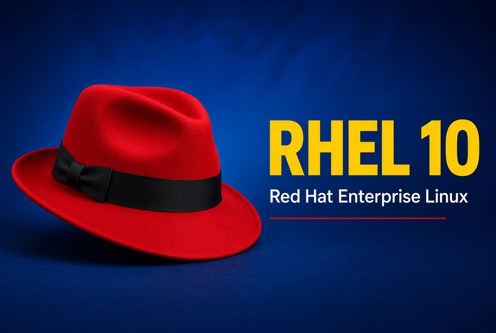
  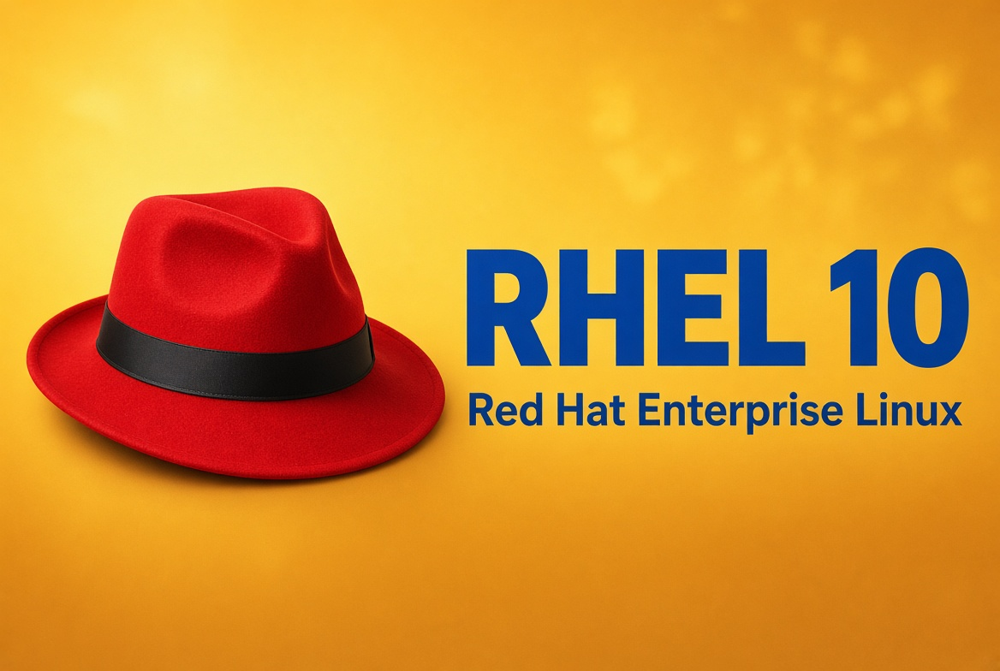

  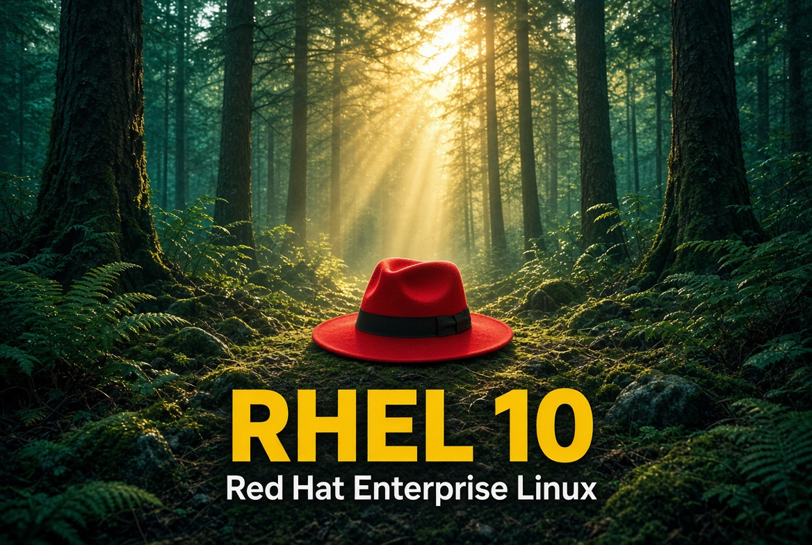
  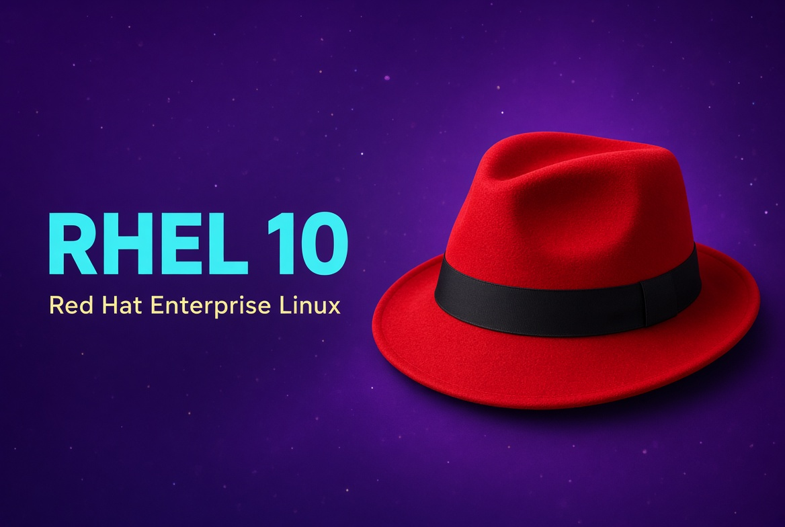

  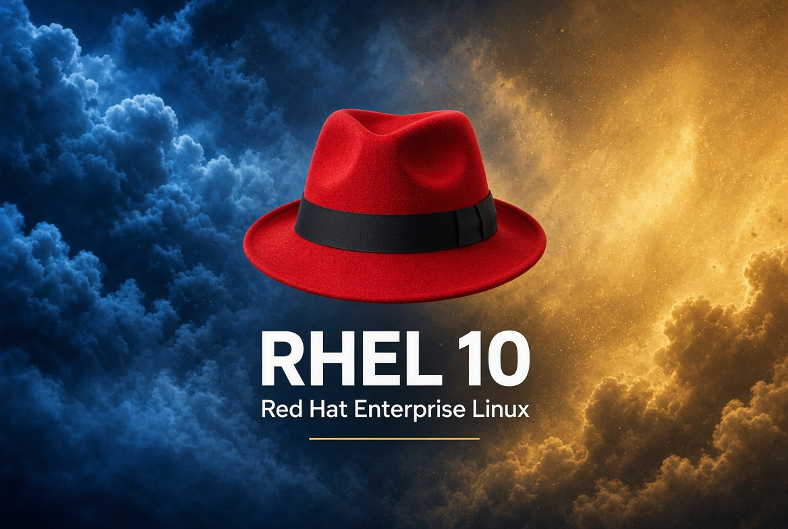

| File | Theme |
|---|---|
| [`QfXn8.jpg`](QfXn8.jpg) | Blue background, yellow RHEL 10 |
| [`bzS52.jpg`](bzS52.jpg) | Yellow/gold background, blue text |
| [`9MJPK.jpg`](9MJPK.jpg) | Forest / teal, yellow title |
| [`U5poz.jpg`](U5poz.jpg) | Purple background, cyan + yellow text |
| [`Th3nk.jpg`](Th3nk.jpg) | Blue + gold split |

---

## RHEL 10 — enterprise

  
  

  
  

  
  

  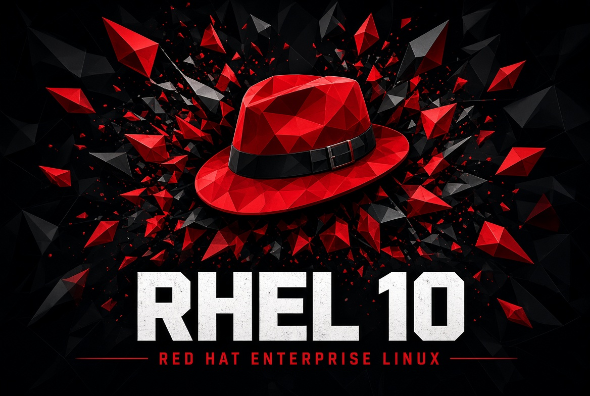
  

  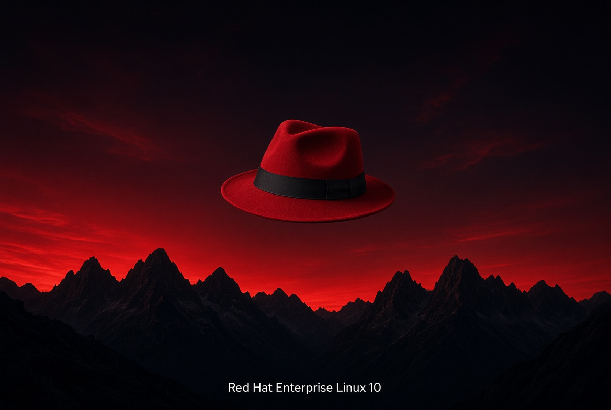
  

| File | Theme |
|---|---|
| [`RVMtJ.jpg`](RVMtJ.jpg) | Classic dark RHEL 10 |
| [`RKq23.jpg`](RKq23.jpg) | Lightspeed / purple AI glow |
| [`uEMx9.jpg`](uEMx9.jpg) | Teal hybrid-cloud mist |
| [`S6jUS.jpg`](S6jUS.jpg) | Image mode / hex grid |
| [`UW0CC.jpg`](UW0CC.jpg) | Post-quantum / shield |
| [`EkUzE.jpg`](EkUzE.jpg) | Light minimal |
| [`pt5tI.jpg`](pt5tI.jpg) | Geometric low-poly |
| [`Tn2pA.jpg`](Tn2pA.jpg) | Terminal / code rain |
| [`6aSVZ.jpg`](6aSVZ.jpg) | Crimson mountains |
| [`pwGBt.jpg`](pwGBt.jpg) | Gold premium |

---

## Red Hat fedora

  
  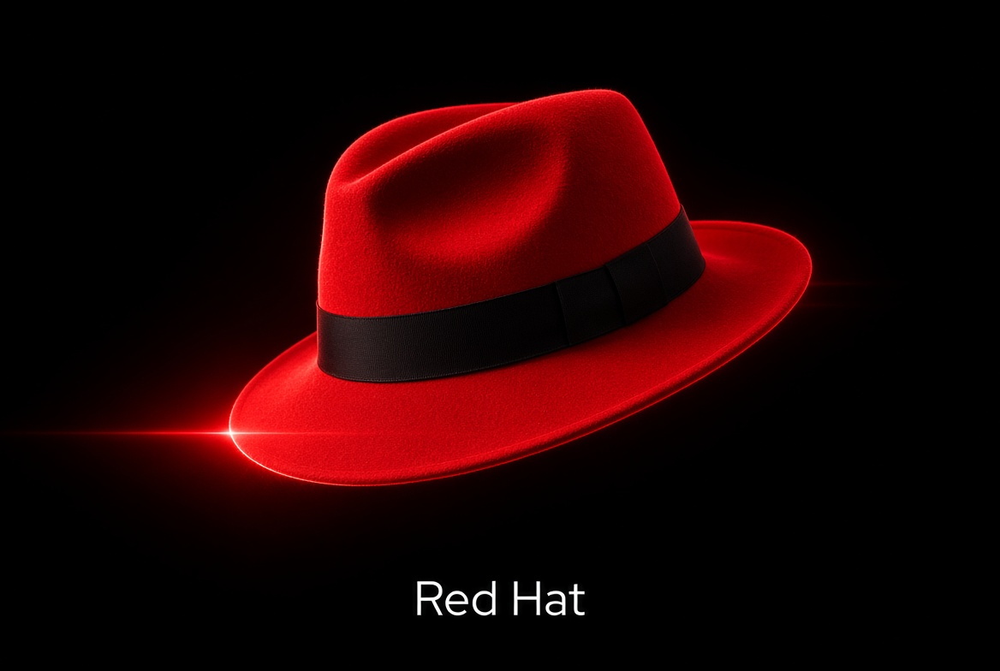

  
  

  
  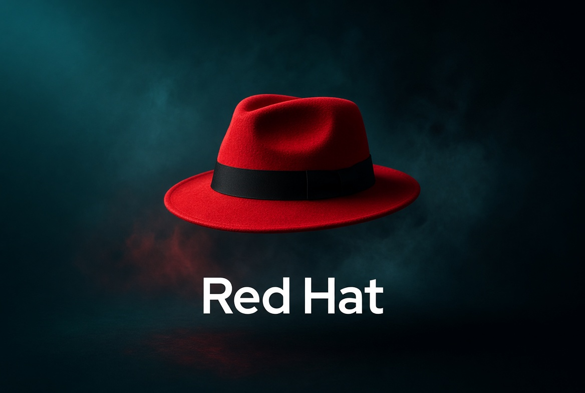

  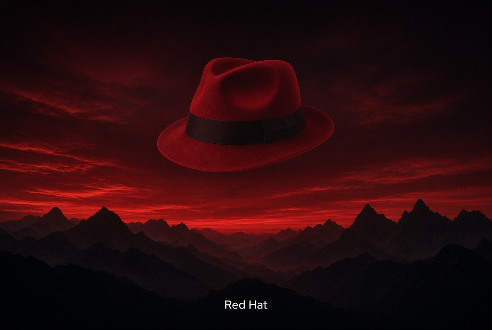
  

  
  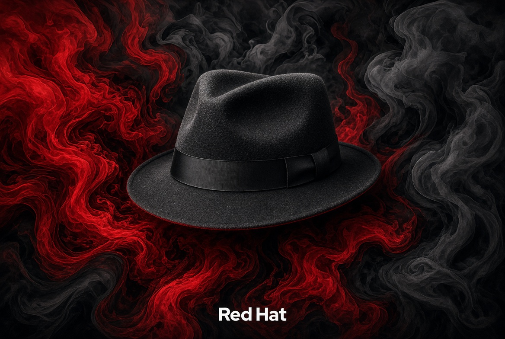

| File | Theme |
|---|---|
| [`IIwxn.jpg`](IIwxn.jpg) | Classic dark fedora |
| [`QPink.jpg`](QPink.jpg) | Neon rim light |
| [`ZBTp0.jpg`](ZBTp0.jpg) | Light / white |
| [`iNZU9.jpg`](iNZU9.jpg) | Geometric shards |
| [`IhcJl.jpg`](IhcJl.jpg) | Circuit / hybrid cloud |
| [`mExW0.jpg`](mExW0.jpg) | Teal atmosphere |
| [`P8K8O.jpg`](P8K8O.jpg) | Red sky mountains |
| [`6olQG.jpg`](6olQG.jpg) | Matrix-style rain |
| [`D0Pla.jpg`](D0Pla.jpg) | Gold dust |
| [`tnxVT.jpg`](tnxVT.jpg) | Ink / smoke |
